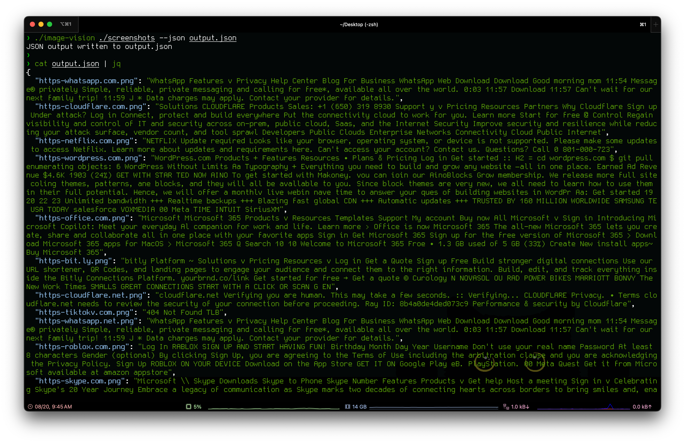

# image-vision

Image text recognition experiments.



This repo contains two implementations.

- The first is an objective-c program that uses Apples [Vision Framework](https://developer.apple.com/documentation/vision/recognizing-text-in-images?language=objc) to perform OCR.
- The second is a simple bash script that runs `tesseract` over images in a directory.

To test, I ran [gowitness](https://github.com/sensepost/gowitness) over a top 1m list found [here](https://tranco-list.eu/).
The Vision Framework implementation seems to perform slightly better, at a significantly faster speed when compared to Tesseract.

Objective-C, Vision Framework Run:

```text
❯ time ./image-vision ./screenshots
      91 words recognized, writing to ./screenshots/https-amazon.com-image-vision.txt
      21 words recognized, writing to ./screenshots/https-bing.com-image-vision.txt
      84 words recognized, writing to ./screenshots/https-bit.ly-image-vision.txt
      82 words recognized, writing to ./screenshots/https-cloudflare.com-image-vision.txt
      36 words recognized, writing to ./screenshots/https-cloudflare.net-image-vision.txt
       8 words recognized, writing to ./screenshots/https-com.plus-image-vision.txt
      82 words recognized, writing to ./screenshots/https-facebook.com-image-vision.txt
      90 words recognized, writing to ./screenshots/https-fastly.net-image-vision.txt
      82 words recognized, writing to ./screenshots/https-fbcdn.net-image-vision.txt
     113 words recognized, writing to ./screenshots/https-gandi.net-image-vision.txt
     175 words recognized, writing to ./screenshots/https-goo.gl-image-vision.txt
      36 words recognized, writing to ./screenshots/https-google.com-image-vision.txt
      19 words recognized, writing to ./screenshots/https-googleapis.com-image-vision.txt
      99 words recognized, writing to ./screenshots/https-googledomains.com-image-vision.txt
      19 words recognized, writing to ./screenshots/https-googleusercontent.com-image-vision.txt
      36 words recognized, writing to ./screenshots/https-googlevideo.com-image-vision.txt
      19 words recognized, writing to ./screenshots/https-gstatic.com-image-vision.txt
      16 words recognized, writing to ./screenshots/https-icloud.com-image-vision.txt
      87 words recognized, writing to ./screenshots/https-instagram.com-image-vision.txt
     262 words recognized, writing to ./screenshots/https-lencr.org-image-vision.txt
      63 words recognized, writing to ./screenshots/https-linkedin.com-image-vision.txt
      76 words recognized, writing to ./screenshots/https-microsoft.com-image-vision.txt
      38 words recognized, writing to ./screenshots/https-netflix.com-image-vision.txt
     213 words recognized, writing to ./screenshots/https-ntp.org-image-vision.txt
     103 words recognized, writing to ./screenshots/https-office.com-image-vision.txt
      78 words recognized, writing to ./screenshots/https-roblox.com-image-vision.txt
     215 words recognized, writing to ./screenshots/https-sharepoint.com-image-vision.txt
     103 words recognized, writing to ./screenshots/https-skype.com-image-vision.txt
       4 words recognized, writing to ./screenshots/https-tiktokv.com-image-vision.txt
      55 words recognized, writing to ./screenshots/https-whatsapp.com-image-vision.txt
      55 words recognized, writing to ./screenshots/https-whatsapp.net-image-vision.txt
     139 words recognized, writing to ./screenshots/https-wikipedia.org-image-vision.txt
     142 words recognized, writing to ./screenshots/https-windows.net-image-vision.txt
     160 words recognized, writing to ./screenshots/https-wordpress.com-image-vision.txt
     134 words recognized, writing to ./screenshots/https-wordpress.org-image-vision.txt
     230 words recognized, writing to ./screenshots/https-yahoo.com-image-vision.txt
      10 words recognized, writing to ./screenshots/https-yandex.net-image-vision.txt
      82 words recognized, writing to ./screenshots/https-zoom.us-image-vision.txt
./image-vision ./screenshots  4.89s user 1.23s system 93% cpu 6.561 total
```

Bash, Tesseract Run:

```text
❯ time ./tesseract.sh ./screenshots
      92 words recognized, writing to ./screenshots/https-amazon.com-tesseract.txt
      11 words recognized, writing to ./screenshots/https-bing.com-tesseract.txt
      71 words recognized, writing to ./screenshots/https-bit.ly-tesseract.txt
      80 words recognized, writing to ./screenshots/https-cloudflare.com-tesseract.txt
      38 words recognized, writing to ./screenshots/https-cloudflare.net-tesseract.txt
       8 words recognized, writing to ./screenshots/https-com.plus-tesseract.txt
      86 words recognized, writing to ./screenshots/https-facebook.com-tesseract.txt
      59 words recognized, writing to ./screenshots/https-fastly.net-tesseract.txt
      86 words recognized, writing to ./screenshots/https-fbcdn.net-tesseract.txt
      88 words recognized, writing to ./screenshots/https-gandi.net-tesseract.txt
     176 words recognized, writing to ./screenshots/https-goo.gl-tesseract.txt
      34 words recognized, writing to ./screenshots/https-google.com-tesseract.txt
      19 words recognized, writing to ./screenshots/https-googleapis.com-tesseract.txt
      98 words recognized, writing to ./screenshots/https-googledomains.com-tesseract.txt
      19 words recognized, writing to ./screenshots/https-googleusercontent.com-tesseract.txt
      34 words recognized, writing to ./screenshots/https-googlevideo.com-tesseract.txt
      19 words recognized, writing to ./screenshots/https-gstatic.com-tesseract.txt
      14 words recognized, writing to ./screenshots/https-icloud.com-tesseract.txt
      87 words recognized, writing to ./screenshots/https-instagram.com-tesseract.txt
     270 words recognized, writing to ./screenshots/https-lencr.org-tesseract.txt
      81 words recognized, writing to ./screenshots/https-linkedin.com-tesseract.txt
      68 words recognized, writing to ./screenshots/https-microsoft.com-tesseract.txt
      34 words recognized, writing to ./screenshots/https-netflix.com-tesseract.txt
     210 words recognized, writing to ./screenshots/https-ntp.org-tesseract.txt
      94 words recognized, writing to ./screenshots/https-office.com-tesseract.txt
     101 words recognized, writing to ./screenshots/https-roblox.com-tesseract.txt
     210 words recognized, writing to ./screenshots/https-sharepoint.com-tesseract.txt
      91 words recognized, writing to ./screenshots/https-skype.com-tesseract.txt
       4 words recognized, writing to ./screenshots/https-tiktokv.com-tesseract.txt
      51 words recognized, writing to ./screenshots/https-whatsapp.com-tesseract.txt
      51 words recognized, writing to ./screenshots/https-whatsapp.net-tesseract.txt
     147 words recognized, writing to ./screenshots/https-wikipedia.org-tesseract.txt
     136 words recognized, writing to ./screenshots/https-windows.net-tesseract.txt
      74 words recognized, writing to ./screenshots/https-wordpress.com-tesseract.txt
     138 words recognized, writing to ./screenshots/https-wordpress.org-tesseract.txt
     204 words recognized, writing to ./screenshots/https-yahoo.com-tesseract.txt
       8 words recognized, writing to ./screenshots/https-yandex.net-tesseract.txt
      63 words recognized, writing to ./screenshots/https-zoom.us-tesseract.txt
./tesseract.sh ./screenshots  15.77s user 0.63s system 96% cpu 16.973 total
```
